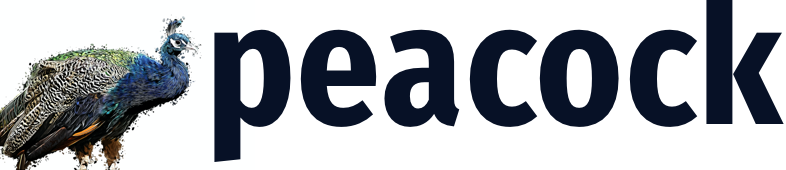

<p align="center"> 
    
 </p>


[](https://raw.githubusercontent.com/BlackrockDigital/startbootstrap-clean-blog/master/LICENSE)

A **static site generator** made for demo's and summaries of academic publications.

## Getting started

To get up and running quickly, just use the following commands:

```console
pipenv install
pipenv run python main.py . -v -c -s -d
```

Or for the more interested forker (or for myself in half a year):

- `-v`: Print debug-level logs
- `-c`: Clear de `build/` folder
- `-s`: Serve a static site at localhost:8000
- `-d`: Show drafts as indicated by the `"draft": True` attribute in the `config.json` file for that post.

## File and folder layout

Posts can be anywhere in the `posts/` folder, including in subfolders. The only requirement is that each post has the following three items on the same level relative to the `config.json` file:

- `config.json`: a json-parsable file with some basic attributes about the blog post.
- `index.md` or `index.html`: The content of the blog post in either markdown or html.
- `resources\`: Resources used in the blog post, like images. These can be referred to as if they were on the same level, since compiling the blog will place them at the same endpoint.

## What is this?

This is my static site generator. It's written in one day and is more an exercise on virtual plumbing instead of software development, as it glues together a bootstrap theme, mustache templating, pandoc and sass compilation.

The layout is based on the [Start Bootstrap - Clean Blog](https://startbootstrap.com/template-overviews/clean-blog/) theme.

## Copyright and License

Code released under the MIT license.

Content of my blog is also in this repo (for example in the `posts/` directory), but is not released under MIT. For the time being, the content's copyright remains with me.
